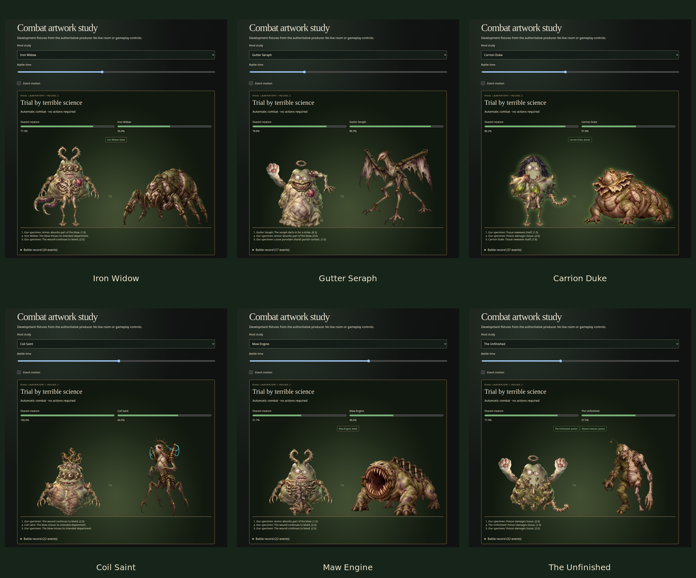

# Step 6 review

Local step 6 implements six authored rivals, seeded automatic combat, actual results/commendations and three-round sessions. No deployment occurred. The approved DNA and definitive creature composition remain unchanged. Numerical decisions, protocol/schema migration and attribution are in [STEP-6-PLAN.md](STEP-6-PLAN.md); actual verification and scope limits are in [IMPLEMENTATION-STATUS.md](IMPLEMENTATION-STATUS.md).

## Actual render review

These are screenshots from the real browser renderer and authoritative fixture producer, not presentation mockups. Inspected silhouettes, grounded feet, modular creature attachments, legible facial anatomy, condition labels and responsive framing. An initial arena frame left shorter creatures floating; the shared transformed part bounds now frame SVG anatomy against the arena floor. Heavy impacts make a restrained camera move that is suppressed during reduced/paused motion. The spent tray is hidden during battle and results. Artwork failures preserve health and expose tested retry controls.



- [Desktop battle](step6-review/battle-desktop.png)
- [Phone portrait](step6-review/battle-phone-portrait.png) and [phone landscape](step6-review/battle-phone-landscape.png)
- [Display with forced static graphics](step6-review/battle-display-static.png)
- [Detached anatomy fixture](step6-review/detached-anatomy.png)
- [Autopsy and observed commendations](step6-review/autopsy-desktop.png)
- [Three-round session results](step6-review/session-results.png)

The six transparent rival masters, exact generation prompts, origin/tool and hashes are retained in [assets/rival-provenance.json](../assets/rival-provenance.json). They were generated with the built-in imagegen tool during development, then optimized offline; no runtime generation or user-supplied art is needed. Existing 34 creature/chamber source records and the high-resolution reference are preserved. Rival runtime files total 382,750 bytes.

## Reproduce

Use Node 24, the committed npm lockfile and installed Chrome/Chromium (`MM_CHROME_PATH` overrides the browser executable). Python/ImageMagick are needed only for offline derivatives/contact sheets.

```sh
npm run check
npm run build
npm run test:step6
python3 scripts/prepare-combat-review.py
```

The aggregate performs the existing step 5 regressions, actual combat runtime/browser checks, composition review and 4,536-case simulation. Individual components passed in this session; the aggregate command itself was not run as one invocation. The final dry run passed 154 tests and produced a 158.07 KiB Worker bundle (37.15 KiB gzip), without publishing. Six combat browser and six combat runtime scenarios passed. All older room/matchmaking/recovery/admission/DNA/presentation/art suites passed. Composition review passed 48 authoritative creatures plus 12 reference samplers. See status for fixture timing and counts.

For interactive development, run `npm run dev` and visit `/combat-gallery`; it has six producer-generated fixtures and time seeking. Regenerate them with `node scripts/prepare-combat-fixtures.mjs`. This gallery is absent from the production build and adds no Worker debug endpoint. For live local multiplayer run `npm run dev:worker` alongside Vite. Rebuild rival WebP from retained masters with `python3 scripts/prepare-rivals.py`.

The [simulation report](step6-review/simulation.json) covers six rivals, three rounds, N=2–8 and three full-budget strategies. Event bounds/control immunity and all 15 event kinds were exercised. Round difficulty increases, but human balance is unverified; tactical knockouts can finish well before 20 seconds. Node timings/file sizes do not measure Cloudflare CPU, network transfer or device performance.

## Human-device checklist after separately authorized deployment

1. Complete a private three-round session on two or more physical devices. Compare battle health, outcomes, team score and commendations. Check fresh blobs/hands/doses, host Next experiment and Play Again.
2. Complete Quick Play with multiple people. Check automatic results, the ten-second readiness minimum, replacements, voluntary Play Again Together and Find New Laboratory.
3. Reload or sleep a phone during battle; briefly disconnect and resume. Confirm playback seeks current time, score commits once and host transfer/display permissions remain correct.
4. Check portrait/landscape and TV viewing distance, reduced/paused motion, artwork retry, keyboard and manual screen reader. Include mobile Safari and Firefox.
5. Assess rivalry difficulty, short knockouts, readability and three-round pacing. Later acceptance still needs cross-region latency and ten-room/100-idle-guest load/free-quota measurements.

Rivals and modular parts have one authored raster pose, animated by decorative transforms. Full precomputed event lists inherently let an inspecting client derive the eventual outcome; explicit results and scores commit only at the authoritative deadline. Physical devices, deployment, broad load/quota and human balance remain unverified. Cards/cabinet/naming, audio/signals and later stages are deferred.

The local runtime can also print an RPC disposal warning during SQLite inspection/reactivation. A standalone probe reproduces it without game code; the named combat helper reduces unnecessary handles but does not silence it. The focused runtime/browser suites still pass. See the follow-up in IMPLEMENTATION-STATUS.md for actual evidence and the optional diagnostic; check the complete suite's final result and exit code.
